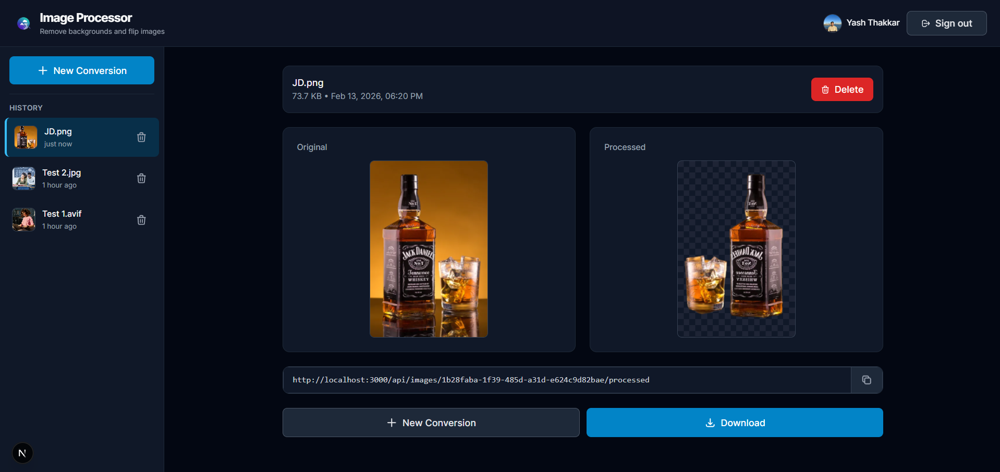
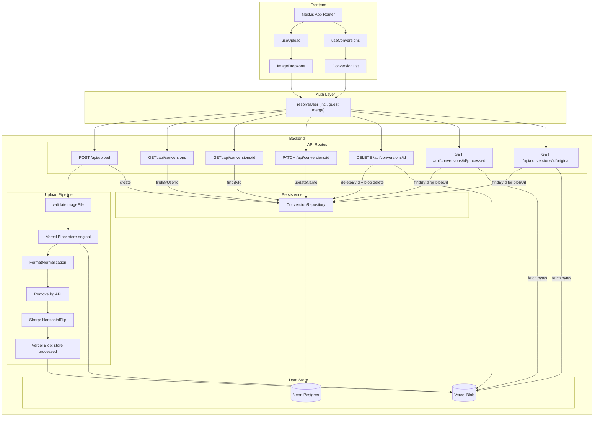

# Image Background Remover

<p align="right">
  <a href="https://uplane-image-bg-remover.vercel.app/">
    
  </a>
</p>

<p align="center">
  
</p>

---

## What It Does

- **Upload** an image (drag-and-drop or click)
- **Process** via Remove.bg (background removal) + Sharp (horizontal flip)
- **Host** processed images on Vercel Blob, served through authenticated proxy
- **Manage** conversions: view before/after, rename, download, delete

All core requirements from the task spec are met and extended with authentication, a database, and a more complete product flow.

---

## Evaluation Criteria

### User Experience & Design

- **Intuitive interface** — Drag-and-drop primary path, clear hierarchy, accessible controls (keyboard, ARIA labels)
- **Clear feedback** — Loading spinner with ScannerPreview during processing; error alerts with retry; invalid-file modal with supported formats
- **Polished feel** — Dark mode, responsive layout (desktop sidebar / mobile drawer), before-after comparison with transparency checkerboard, inline rename, tooltips for long filenames

### Backend Engineering

- **API structure** — RESTful routes with consistent envelope (`{ success, data }` or `{ success: false, error: { message, code } }`), appropriate HTTP status codes, and structured error handling
- **Process management** — Pipeline pattern (format normalization → background removal → horizontal flip); each step self-contained with its own retries and error mapping
- **Code quality** — TypeScript strict mode, interfaces for pipeline steps and storage, modular layout (pipeline, auth, storage, repository), API keys only in env vars

---

## Tech Stack

| Layer              | Choice                  | Reason                                                            |
| ------------------ | ----------------------- | ----------------------------------------------------------------- |
| Framework          | Next.js 16 (App Router) | Single codebase for UI and API, easy Vercel deploy, no CORS setup |
| Language           | TypeScript              | Type safety, strict mode                                          |
| Database           | Neon Postgres (Vercel)  | Serverless PostgreSQL, branching, connection pooling for edge     |
| ORM                | Prisma 5                | Type-safe queries, schema-first migrations                        |
| Auth               | NextAuth v5 (Auth.js)   | Google OAuth, JWT sessions, Prisma adapter                        |
| Storage            | Vercel Blob             | Integrated with Next.js, serverless-friendly                      |
| Background Removal | Remove.bg API           | Free tier (50 calls/month)                                        |
| Image Ops          | Sharp                   | Local transformations (format, flip)                              |
| Styling            | Tailwind CSS            | Fast styling, dark mode via `dark:`                               |

---

## System Architecture

The diagram below shows the complete system: frontend, API routes, authentication, processing pipeline, storage, and database. **All conversion endpoints connect to Neon Postgres** — the database stores metadata and ownership; Vercel Blob stores image bytes; image proxy routes serve blobs through authentication.



---

## Architecture & Design Decisions

### Product Decisions

- **Authentication** — Data ownership; blob URLs never exposed; images served via authenticated proxy only.

- **Guest mode** — Low-friction: upload without sign-in; auto-merge into OAuth account when they sign in later.

- **Database (Neon)** — Metadata and user linkage live in DB; blob storage is pure file ops; enables queries without scanning blobs.

### Backend Design (Scalability & Clean Architecture)

- **Pipeline pattern** — `ImageProcessingPipeline` + `IImageProcessingStep` interface. Add new steps without touching the pipeline or route; each step self-contained with retries and error mapping. Open/Closed Principle.
- **Custom errors** — `PipelineStepError` (stepName, code, statusCode) for pipeline failures; `BlobStorageError` (operation) for storage. Route catches by type, maps to HTTP; no string matching.
- **DRY helpers** — `authorizeConversionAccess()` for auth + ownership across 4 routes; `serveImageProxy()` shared config for processed vs original.
- **Repository pattern** — `ConversionRepository` centralizes DB ops; supports transaction client for atomic guest merge.
- **Interface segregation** — `IBlobStorageService`, `IImageProcessingStep`; swap implementations without changing consumers.
- **Single UUID** — Conversion ID used for blob paths and DB record; one ID, consistency.
- **Constants** — `image-formats.ts` (MIME types, size, UI labels); one source for validation, hooks, dropzone.
- **Prisma singleton** — Prevents connection exhaustion under Next.js hot reload.

### Frontend Design

- **Custom hooks** — `useUpload`, `useConversions`, `useConversion`, `useDeleteConfirmation`, `useWindowDragDrop`; no global state lib.
- **Icon components** — Shared `IconUpload`, `IconTrash`, etc.; no duplicated SVGs.
- **Reusable primitives** — `Modal`, `ConfirmationModal`, `Button`, `Card`, `Spinner`, `Alert`, `TransparencyBackground`.
- **Type safety** — `ApiResponse<T>` discriminated union; `ProcessedImage`; `ValidationResult`.

---

## Project Structure

```
app/
  page.tsx, layout.tsx, providers.tsx
  api/
    auth/[...nextauth]/     # NextAuth (Google OAuth)
    upload/                 # POST — upload, process, store
    conversions/                 # GET — list conversions
    conversions/[id]/             # GET/PATCH/DELETE — metadata, rename, delete
    conversions/[id]/processed/   # GET — processed image (auth proxy)
    conversions/[id]/original/   # GET — original image (auth proxy)

components/
  app-shell, header, sidebar
  image-dropzone, scanner-preview
  conversion-result, conversion-list-item
  modal, confirmation-modal, login-prompt, login-modal
  transparency-background, alert, button, card, spinner
  icons/

lib/
  pipeline/          # pipeline, steps, custom errors
  auth/              # guest, resolve-user, merge-guest
  services/          # conversion.repository, storage
  utils/             # validation, api-response, image-proxy
  hooks/
  constants/, types/
  prisma.ts

auth.ts, proxy.ts
prisma/
```

---

## Getting Started

### Prerequisites

- Node.js 18+
- npm or pnpm

### Setup

1. Clone and install: `npm install`
2. Create `.env.local` with:
   - `REMOVEBG_API_KEY` — [Remove.bg API key](https://www.remove.bg/api)
   - `BLOB_READ_WRITE_TOKEN` — From Vercel Blob
   - `DATABASE_URL` — Neon Postgres (or other PostgreSQL)
   - `DIRECT_DATABASE_URL` — Direct connection for Prisma migrations
   - `AUTH_SECRET` — NextAuth signing secret
   - `AUTH_GOOGLE_ID` / `AUTH_GOOGLE_SECRET` — For Google OAuth (optional; guest works without it)
3. Migrate: `npx prisma migrate deploy`
4. Run: `npm run dev`

### Scripts

- `npm run dev` — Development server
- `npm run build` — Production build
- `npm run start` — Start production server
- `npm run lint` — ESLint

---

## Supported Formats

PNG, JPEG, WebP, GIF, AVIF, TIFF, SVG, HEIC. Max 20MB. Images are normalized to PNG before background removal.

---

## Security Notes

- Blob URLs are never sent to the client; images are always served via authenticated proxy routes.
- Guest cookies are signed JWTs (`httpOnly`, `secure` in prod).
- API keys and secrets are only used server-side.
- Ownership is enforced on all image operations.
